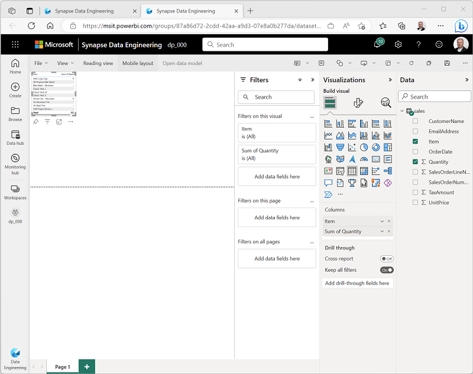
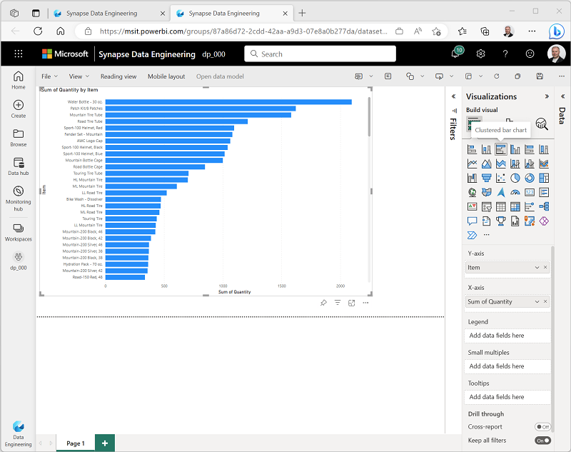

---
lab:
    title: 'Microsoft Fabric レイクハウスの作成'
    module: 'Microsoft Fabric でレイクハウスを始める'
---

# レイクハウスの作成

従来、大規模なデータ分析ソリューションは *データウェアハウス* を中心に構築されており、データはリレーショナルテーブルに格納され、SQL を使用してクエリされていました。新しいデータ資産の高い *ボリューム*、*多様性*、*速度* を特徴とする「ビッグデータ」の増加と、低コストのストレージおよびクラウドスケールの分散コンピューティング技術の利用可能性が、分析データストレージの代替アプローチである *データレイク* へと導いています。データレイクでは、データは固定スキーマをストレージに課さずにファイルとして格納されます。ますます多くのデータエンジニアやアナリストが、これらのアプローチの最良の機能を組み合わせることを求めており、データレイクにファイルを格納し、メタデータレイヤーとしてリレーショナルスキーマを適用して、従来のSQLセマンティクスを使用してクエリできる *レイクハウス* が登場しています。

Microsoft Fabric では、レイクハウスは *OneLake* ストア（Azure Data Lake Store Gen2に基づいて構築）で非常にスケーラブルなファイルストレージを提供し、オープンソースの *Delta Lake* テーブルフォーマットに基づいたテーブルやビューなどのリレーショナルオブジェクトのメタストアを備えています。Delta Lake を使用すると、レイクハウス内のテーブルのスキーマを定義し、SQL を使用してクエリすることができます。

このラボは約 **30** 分で完了します。

> **注意**: この演習を完了するには、Microsoft の *学校* または *職場* のアカウントが必要です。お持ちでない場合は、[Microsoft Office 365 E3 以上の試用版にサインアップ](https://www.microsoft.com/microsoft-365/business/compare-more-office-365-for-business-plans)することができます。

## ワークスペースの作成

Fabric でデータを操作する前に、Fabric の試用版が有効なワークスペースを作成します。

1. `https://app.fabric.microsoft.com` の [Microsoft Fabric ホームページ](https://app.fabric.microsoft.com) で、**Synapse Data Engineering** を選択します。
1. 左側のメニューバーで、**Workspaces** を選択します（アイコンは &#128455; に似ています）。
1. **Advanced** セクションで Fabric 容量を含むライセンスモード（*Trial*、*Premium*、または *Fabric*）を選択して、お好きな名前で新しいワークスペースを作成します。
1. 新しいワークスペースが開くと、空になっているはずです。

    

## レイクハウスの作成

ワークスペースができたので、データファイル用のレイクハウスを作成する時が来ました。

1. **Synapse Data Engineering** ホームページで、お好きな名前で新しい **レイクハウス** を作成します。

    1分ほどで、新しいレイクハウスが作成されます：

    

1. 新しいレイクハウスを表示し、左側の **Lakehouse explorer** ペインでレイクハウス内のテーブルやファイルを閲覧できることに注意してください：
    - **Tables** フォルダには、SQL セマンティクスを使用してクエリできるテーブルが含まれています。Microsoft Fabric レイクハウスのテーブルは、Apache Spark で一般的に使用されるオープンソースの *Delta Lake* ファイルフォーマットに基づいています。
    - **Files** フォルダには、管理されていないデルタテーブルに関連付けられていないレイクハウスの OneLake ストレージのデータファイルが含まれています。このフォルダには、外部に格納されているデータを参照する *ショートカット* も作成できます。

    現在、レイクハウスにはテーブルやファイルがありません。

## ファイルのアップロード

Fabric は、外部ソースからデータをコピーするパイプラインをサポートする機能や、Power Query に基づいたビジュアルツールを使用して定義できるデータフロー（Gen 2）など、レイクハウスにデータをロードする複数の方法を提供しています。しかし、小規模なデータを取り込む最も簡単な方法の一つは、ローカルコンピュータ（または該当する場合はラボ VM）からファイルやフォルダをアップロードすることです。

1. [sales.csv](https://raw.githubusercontent.com/MicrosoftLearning/dp-data/main/sales.csv) ファイルを `https://raw.githubusercontent.com/MicrosoftLearning/dp-data/main/sales.csv` からダウンロードし、ローカルコンピュータ（または該当する場合はラボ VM）に **sales.csv** として保存します。

   > **注**: ファイルをダウンロードするには、ブラウザで新しいタブを開き、URL を貼り付けます。データが含まれているページ上のどこかを右クリックし、**名前を付けて保存** を選択して、ページを CSV ファイルとして保存します。

2. レイクハウスを含むウェブブラウザのタブに戻り、**Lakehouse explorer** ペインの **Files** フォルダの **...** メニューで **新しいサブフォルダ** を選択し、**data** という名前のサブフォルダを作成します。
3. 新しい **data** フォルダの **...** メニューで **アップロード** を選択し、**ファイルのアップロード** を行い、ローカルコンピュータ（または該当する場合はラボ VM）から **sales.csv** ファイルをアップロードします。
4. ファイルがアップロードされたら、**Files/data** フォルダを選択し、以下に示すように **sales.csv** ファイルがアップロードされていることを確認します。

    

5. **sales.csv** ファイルを選択して、その内容のプレビューを表示します。

## ショートカットの探索

多くのシナリオでは、レイクハウスで作業する必要があるデータは、他の場所に保存されていることがあります。レイクハウスの OneLake ストレージにデータを取り込む方法は多数ありますが、別のオプションとして *ショートカット* を作成することができます。ショートカットを使用すると、データのコピーに伴うオーバーヘッドやデータ不整合のリスクなしに、外部ソースのデータを分析ソリューションに含めることができます。

1. **Files** フォルダの **...** メニューで **新しいショートカット** を選択します。
2. ショートカットに利用可能なデータソースの種類を表示します。その後、ショートカットを作成せずに **新しいショートカット** ダイアログボックスを閉じます。

## ファイルデータをテーブルにロード

アップロードした販売データはファイルにあり、データアナリストやエンジニアは Apache Spark コードを使用して直接作業することができます。しかし、多くのシナリオでは、ファイルからデータをテーブルにロードして、SQL を使用してクエリすることが望ましいかもしれません。

1. **ホーム** ページで **Files/Data** フォルダを選択し、そこに含まれている **sales.csv** ファイルを表示します。
2. **sales.csv** ファイルの **...** メニューで **テーブルへのロード** を選択します。
3. **テーブルへのロード** ダイアログボックスで、テーブル名を **sales** に設定し、ロード操作を確認します。その後、テーブルが作成されロードされるのを待ちます。

    > **ヒント**: **sales** テーブルが自動的に表示されない場合は、**Tables** フォルダの **...** メニューで **更新** を選択します。

3. **Lakehouse explorer** ペインで、作成された **sales** テーブルを選択してデータを表示します。

    

4. **sales** テーブルの **...** メニューで **ファイルの表示** を選択し、このテーブルの基になるファイルを表示します。

    

    デルタテーブルのファイルは *Parquet* 形式で保存され、テーブルに適用されたトランザクションの詳細が記録されている **_delta_log** という名前のサブフォルダが含まれています。

## SQLを使用してテーブルをクエリする

レイクハウスを作成し、その中にテーブルを定義すると、SQL `SELECT` ステートメントを使用してテーブルをクエリできるSQLエンドポイントが自動的に作成されます。

1. レイクハウスページの右上で、**レイクハウス**から**SQLアナリティクスエンドポイント**に切り替えます。その後、レイクハウスのSQLアナリティクスエンドポイントがテーブルをクエリできる視覚的インターフェースで開くまで少し待ちます。

2. **新しいSQLクエリ**ボタンを使用して新しいクエリエディタを開き、次のSQLクエリを入力します：

    ```sql
   SELECT Item, SUM(Quantity * UnitPrice) AS Revenue
   FROM sales
   GROUP BY Item
   ORDER BY Revenue DESC;
    ```

3. **&#9655; 実行**ボタンを使用してクエリを実行し、結果を表示します。結果には、各製品の合計収益が表示されるはずです。

    

## ビジュアルクエリを作成する

多くのデータ専門家がSQLに精通していますが、Power BIの経験を持つデータアナリストは、ビジュアルクエリを作成するためにPower Queryスキルを活用できます。

1. ツールバーで、**新しいビジュアルクエリ**を選択します。
2. **sales**テーブルを新しく開いたビジュアルクエリエディタペインにドラッグして、次のようにPower Queryを作成します：

    

3. **列の管理**メニューで、**列の選択**を選択します。次に、**SalesOrderNumber**と**SalesOrderLineNumber**の列のみを選択します。

    

4. **変換**メニューで、**グループ化**を選択します。次に、以下の**基本**設定を使用してデータをグループ化します：

    - **グループ化**：SalesOrderNumber
    - **新しい列名**：LineItems
    - **操作**：異なる値のカウント
    - **列**：SalesOrderLineNumber

    完了すると、ビジュアルクエリの下の結果ペインには、各販売注文の項目数が表示されます。

    

## レポートを作成する

レイクハウス内のテーブルは、Power BIでレポートを作成するためのデフォルトのセマンティックモデルに自動的に追加されます。

1. SQLエンドポイントページの下部で、**モデル**タブを選択します。セマンティックモデルのデータモデルスキーマが表示されます。

    

    > **注**：この演習では、セマンティックモデルは単一のテーブルで構成されています。実際のシナリオでは、レイクハウスに複数のテーブルを作成し、それぞれがモデルに含まれるでしょう。その後、モデル内でこれらのテーブル間の関係を定義できます。

2. メニューリボンで、**レポーティング**タブを選択します。次に、**新しいレポート**を選択します。新しいブラウザタブが開き、レポートをデザインできます。

    

3. 右側の**データ**ペインで、**sales**テーブルを展開します。次に、以下のフィールドを選択します：
    - **Item**
    - **Quantity**

    テーブルビジュアライゼーションがレポートに追加されます：

    

4. より多くのスペースを作るために、**データ**と**フィルター**のペインを非表示にします。次に、テーブルビジュアライゼーションが選択されていることを確認し、**ビジュアライゼーション**ペインでビジュアライゼーションを**クラスター化された棒グラフ**に変更し、次のようにサイズを変更します。

    

5. **ファイル**メニューで、**保存**を選択します。その後、以前に作成したワークスペースに**Item Sales Report**としてレポートを保存します。
6. レポートが含まれるブラウザタブを閉じて、レイクハウスのSQLエンドポイントに戻ります。次に、左側のハブメニューバーでワークスペースを選択し、以下のアイテムが含まれていることを確認します：
    - あなたのレイクハウス。
    - レイクハウスのSQLアナリティクスエンドポイント。
    - レイクハウス内のテーブルのデフォルトセマンティックモデル。
    - **Item Sales Report**レポート。

## リソースのクリーンアップ

この演習では、レイクハウスを作成し、データをインポートしました。レイクハウスは、OneLake データストアに保存されたファイルとテーブルで構成されていることがわかりました。管理されたテーブルは SQL を使用してクエリを実行でき、データの視覚化をサポートするデフォルトのセマンティックモデルに含まれています。

レイクハウスの探索が終わったら、この演習で作成したワークスペースを削除できます。

1. 左側のバーで、ワークスペースのアイコンを選択して、その中に含まれるすべてのアイテムを表示します。
2. ツールバーの **...** メニューで、**ワークスペースの設定** を選択します。
3. **その他** セクションで、**このワークスペースを削除** を選択します。
