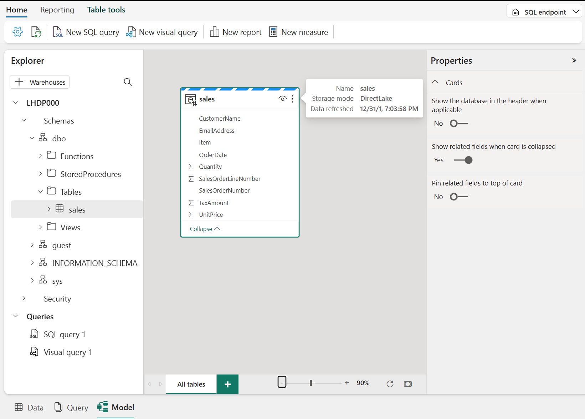
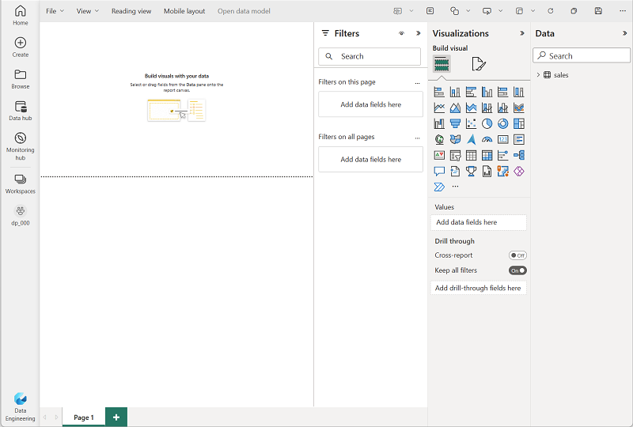

---
lab:
    title: 'Microsoft Fabric レイクハウスを作成する'
    module: 'Microsoft Fabric でレイクハウスを始める'
---

# レイクハウスを作成する

大規模なデータ分析ソリューションは従来、*データウェアハウス*を中心に構築されており、データはリレーショナルテーブルに格納され、SQLを使用してクエリされます。新しいデータ資産の高い*ボリューム*、*多様性*、および*速度*を特徴とする「ビッグデータ」の増加と、低コストのストレージおよびクラウドスケールの分散コンピューティング技術の利用可能性により、分析データストレージの代替アプローチである*データレイク*が登場しました。データレイクでは、データは固定スキーマを強制せずにファイルとして格納されます。データエンジニアやアナリストは、これらのアプローチの最良の機能を組み合わせることで、データをデータレイクのファイルに格納し、メタデータレイヤーとしてリレーショナルスキーマを適用して、従来のSQLセマンティクスを使用してクエリできる*レイクハウス*をますます求めています。

Microsoft Fabricでは、レイクハウスは*OneLake*ストア（Azure Data Lake Store Gen2に基づいて構築）で非常にスケーラブルなファイルストレージを提供し、オープンソースの*Delta Lake*テーブルフォーマットに基づいたテーブルやビューなどのリレーショナルオブジェクトのメタストアを備えています。Delta Lakeを使用すると、レイクハウス内のテーブルのスキーマを定義し、SQLを使用してクエリすることができます。

このラボは約**30**分で完了します。

> **注意**: この演習を完了するには、Microsoftの*学校*または*職場*のアカウントが必要です。お持ちでない場合は、[Microsoft Office 365 E3以上のトライアルにサインアップ](https://www.microsoft.com/microsoft-365/business/compare-more-office-365-for-business-plans)することができます。

## ワークスペースを作成する

Fabricでデータを操作する前に、Fabricのトライアルが有効なワークスペースを作成します。

1. `https://app.fabric.microsoft.com`の[Microsoft Fabricホームページ](https://app.fabric.microsoft.com)で、**Synapse Data Engineering**を選択します。
1. 左側のメニューバーで、**Workspaces**（アイコンは&#128455;に似ています）を選択します。
1. **Advanced**セクションでFabricの容量を含むライセンスモード（*Trial*、*Premium*、または*Fabric*）を選択して、お好きな名前で新しいワークスペースを作成します。
1. 新しいワークスペースが開くと、空になっているはずです。

    

## レイクハウスを作成する

ワークスペースができたので、次はデータファイル用のレイクハウスを作成します。

1. **Synapse Data Engineering**ホームページで、お好きな名前で新しい**レイクハウス**を作成します。

    1分ほどすると、新しいレイクハウスが作成されます：

    

1. 新しいレイクハウスを表示し、左側の**レイクハウスエクスプローラー**ペインでレイクハウス内のテーブルとファイルを閲覧できることに注意してください：
    - **Tables**フォルダには、SQLセマンティクスを使用してクエリできるテーブルが含まれています。Microsoft Fabricレイクハウスのテーブルは、Apache Sparkで一般的に使用されるオープンソースの*Delta Lake*ファイルフォーマットに基づいています。
    - **Files**フォルダには、管理されていないデルタテーブルに関連付けられていないレイクハウスのOneLakeストレージのデータファイルが含まれています。このフォルダには、外部に格納されているデータを参照するための*ショートカット*も作成できます。

    現在、レイクハウスにはテーブルもファイルもありません。

## ファイルをアップロードする

Fabricでは、外部ソースからのデータをコピーするパイプラインの組み込みサポートや、Power Queryに基づいた視覚的ツールを使用して定義できるデータフロー（Gen 2）など、レイクハウスにデータをロードする複数の方法を提供しています。しかし、少量のデータを取り込む最も簡単な方法の一つは、ローカルコンピュータ（または該当する場合はラボVM）からファイルやフォルダをアップロードすることです。

1. [sales.csv](https://raw.githubusercontent.com/MicrosoftLearning/dp-data/main/sales.csv)ファイルを`https://raw.githubusercontent.com/MicrosoftLearning/dp-data/main/sales.csv`からダウンロードし、ローカルコンピュータ（または該当する場合はラボVM）に**sales.csv**として保存します。

   > **注**: ファイルをダウンロードするには、ブラウザで新しいタブを開き、URLを貼り付けます。データが含まれているページ上のどこかを右クリックし、**名前を付けて保存**を選択して、ページをCSVファイルとして保存します。

2. レイクハウスを含むウェブブラウザのタブに戻り、**Lakehouse explorer**ペインの**Files**フォルダの**...**メニューで**New subfolder**を選択し、**data**という名前のサブフォルダを作成します。
3. 新しい**data**フォルダの**...**メニューで**Upload**を選択し、**Upload file**を選択してから、ローカルコンピュータ（または該当する場合はラボVM）から**sales.csv**ファイルをアップロードします。
4. ファイルがアップロードされた後、**Files/data**フォルダを選択し、以下に示すように**sales.csv**ファイルがアップロードされていることを確認します：

    

5. **sales.csv**ファイルを選択して、その内容のプレビューを表示します。

## ショートカットを探る

多くのシナリオでは、レイクハウスで作業する必要があるデータは他の場所に保存されている場合があります。レイクハウスのOneLakeストレージにデータを取り込む方法は多数ありますが、別のオプションとして*ショートカット*を作成することができます。ショートカットを使用すると、データのコピーに伴うオーバーヘッドやデータ不整合のリスクなしに、外部ソースのデータを分析ソリューションに含めることができます。

1. **Files**フォルダの**...**メニューで**New shortcut**を選択します。
2. ショートカットに利用可能なデータソースタイプを表示します。その後、ショートカットを作成せずに**New shortcut**ダイアログボックスを閉じます。

## ファイルデータをテーブルにロードする

アップロードした販売データはファイルにあり、データアナリストやエンジニアはApache Sparkコードを使用して直接作業することができます。しかし、多くのシナリオでは、ファイルからデータをテーブルにロードして、SQLを使用してクエリすることが望ましいかもしれません。

1. **Home**ページで**Files/Data**フォルダを選択し、それが含む**sales.csv**ファイルを表示します。
2. **sales.csv**ファイルの**...**メニューで**Load to Tables**を選択します。
3. **Load to table**ダイアログボックスで、テーブル名を**sales**に設定し、ロード操作を確認します。その後、テーブルが作成されロードされるまで待ちます。

    > **Tip**: **sales**テーブルが自動的に表示されない場合は、**Tables**フォルダの**...**メニューで**Refresh**を選択します。

3. **Lakehouse explorer**ペインで、作成された**sales**テーブルを選択してデータを表示します。

    

4. **sales**テーブルの**...**メニューで**View files**を選択し、このテーブルの基になるファイルを表示します。

    

    デルタテーブルのファイルは*Parquet*形式で保存され、テーブルに適用されたトランザクションの詳細が記録されている**_delta_log**という名前のサブフォルダが含まれています。

## SQLを使用してテーブルをクエリする

レイクハウスを作成し、その中にテーブルを定義すると、SQL `SELECT`ステートメントを使用してテーブルをクエリできるSQLエンドポイントが自動的に作成されます。

1. レイクハウスページの右上で、**Lakehouse**から**SQL analytics endpoint**に切り替えます。その後、レイクハウスのSQLアナリティクスエンドポイントが開くまで少し待ちます。これは、テーブルをクエリできる視覚的インターフェースです。

2. **New SQL query**ボタンを使用して新しいクエリエディタを開き、次のSQLクエリを入力します：

    ```sql
   SELECT Item, SUM(Quantity * UnitPrice) AS Revenue
   FROM sales
   GROUP BY Item
   ORDER BY Revenue DESC;
    ```

3. **&#9655; Run**ボタンを使用してクエリを実行し、結果を表示します。これには、各製品の総収益が表示されるはずです。

    

## ビジュアルクエリを作成する

多くのデータ専門家はSQLに精通していますが、Power BIの経験を持つデータアナリストは、ビジュアルクエリを作成するためにPower Queryスキルを活用することができます。

1. ツールバーで**New visual query**を選択します。
2. 新しく開いたビジュアルクエリエディタペインに**sales**テーブルをドラッグして、以下に示すようなPower Queryを作成します：

    

3. **Manage columns**メニューで**Choose columns**を選択します。その後、**SalesOrderNumber**と**SalesOrderLineNumber**の列のみを選択します。

    

4. **Transform**メニューで**Group by**を選択します。その後、以下の**Basic**設定を使用してデータをグループ化します：

    - **Group by**: SalesOrderNumber
    - **New column name**: LineItems
    - **Operation**: Count distinct values
    - **Column**: SalesOrderLineNumber

    完了すると、ビジュアルクエリの下の結果ペインには、各販売注文の項目数が表示されます。

    

## レポートの作成

レイクハウス内のテーブルは、Power BIでのレポート作成用に自動的にデフォルトのセマンティックモデルに追加されます。

1. SQLエンドポイントページの下部で、**モデル**タブを選択します。セマンティックモデルのデータモデルスキーマが表示されます。

    

    > **注**: この演習では、セマンティックモデルは単一のテーブルで構成されています。実際のシナリオでは、レイクハウスに複数のテーブルを作成し、それぞれがモデルに含まれることになるでしょう。その後、モデル内でこれらのテーブル間の関係を定義することができます。

2. メニューリボンで、**レポーティング**タブを選択します。次に、**新しいレポート**を選択します。新しいブラウザタブが開き、レポートのデザインができます。

    

3. 右側の**データ**ペインで、**sales**テーブルを展開し、次のフィールドを選択します：
    - **Item**
    - **Quantity**

    テーブルビジュアライゼーションがレポートに追加されます：

    

4. より多くのスペースを作るために、**データ**と**フィルター**のペインを非表示にします。次に、テーブルビジュアライゼーションが選択されていることを確認し、**ビジュアライゼーション**ペインでビジュアライゼーションを**クラスター化された棒グラフ**に変更し、ここに示されているようにサイズを変更します。

    

5. **ファイル**メニューで、**保存**を選択します。次に、以前に作成したワークスペースに**アイテム販売レポート**としてレポートを保存します。
6. レポートが含まれるブラウザタブを閉じて、レイクハウスのSQLエンドポイントに戻ります。次に、左側のハブメニューバーで、作成したワークスペースを選択し、次のアイテムが含まれていることを確認します：
    - あなたのレイクハウス。
    - レイクハウスのSQLアナリティクスエンドポイント。
    - レイクハウス内のテーブル用のデフォルトのセマンティックモデル。
    - **アイテム販売レポート**レポート。

## リソースのクリーンアップ

この演習では、レイクハウスを作成し、データをインポートしました。レイクハウスは、OneLakeデータストアに保存されたファイルとテーブルで構成されていることがわかりました。管理されたテーブルはSQLを使用してクエリを実行でき、データの視覚化をサポートするためにデフォルトのセマンティックモデルに含まれています。

レイクハウスの探索が終わったら、この演習用に作成したワークスペースを削除できます。

1. 左側のバーで、ワークスペースのアイコンを選択して、含まれているすべてのアイテムを表示します。
2. ツールバーの**...**メニューで、**ワークスペースの設定**を選択します。
3. **その他**セクションで、**このワークスペースを削除**を選択します。
