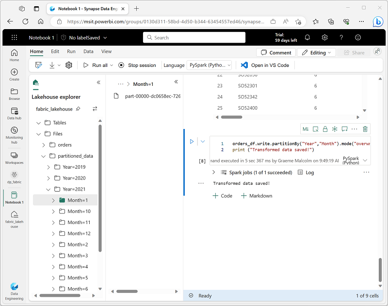
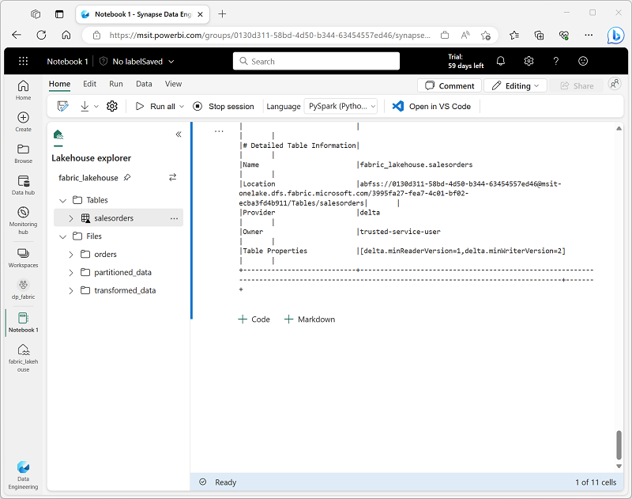

---
lab:
    title: 'Apache Spark を使ってデータを分析する'
    module: 'レイクハウス内のファイルを Apache Spark で操作する'
---

# Apache Spark を使ってデータを分析する

Apache Spark は分散データ処理用のオープンソースエンジンであり、データレイクストレージ内の膨大なデータ量を探索、処理、分析するために広く使用されています。Spark は Azure HDInsight、Azure Databricks、Azure Synapse Analytics、Microsoft Fabric など、多くのデータプラットフォーム製品で処理オプションとして利用可能です。Spark の利点の一つは、Java、Scala、Python、SQL など、幅広いプログラミング言語をサポートしていることであり、データクレンジングや操作、統計分析と機械学習、データ分析と可視化を含むデータ処理ワークロードにとって非常に柔軟なソリューションです。

このラボを完了するには約 **45** 分かかります。

> **注**: この演習を完了するには、Microsoft の *学校* または *職場* のアカウントが必要です。お持ちでない場合は、[Microsoft Office 365 E3 以上のトライアルにサインアップ](https://www.microsoft.com/microsoft-365/business/compare-more-office-365-for-business-plans)することができます。

## ワークスペースを作成する

Fabric でデータを操作する前に、Fabric トライアルが有効なワークスペースを作成します。

1. `https://app.fabric.microsoft.com` の [Microsoft Fabric ホームページ](https://app.fabric.microsoft.com) で、**Synapse Data Engineering** を選択します。
1. 左側のメニューバーで、**Workspaces** (アイコンは &#128455; に似ています) を選択します。
1. お好きな名前で新しいワークスペースを作成し、**Advanced** セクションで Fabric 容量を含むライセンスモード (*Trial*、*Premium*、または *Fabric*) を選択します。
1. 新しいワークスペースが開いたら、空であるはずです。

    

## レイクハウスを作成し、ファイルをアップロードする

ワークスペースができたので、分析するデータファイル用のレイクハウスを作成する時が来ました。

1. **Synapse Data Engineering** ホームページで、お好きな名前で新しい **レイクハウス** を作成します。

    1分ほどで、新しい空のレイクハウスが作成されます。分析のためにデータレイクハウスにデータを取り込む必要があります。これには複数の方法がありますが、この演習では、ローカルコンピューター (または該当する場合はラボ VM) にテキストファイルのフォルダーをダウンロードして抽出し、それをレイクハウスにアップロードするだけです。

1. `https://github.com/MicrosoftLearning/dp-data/raw/main/orders.zip` からこの演習の[データファイル](https://github.com/MicrosoftLearning/dp-data/raw/main/orders.zip)をダウンロードして抽出します。

1. 圧縮アーカイブを抽出した後、**2019.csv**、**2020.csv**、**2021.csv** という CSV ファイルが含まれている **orders** という名前のフォルダーがあることを確認します。
1. レイクハウスを含むウェブブラウザのタブに戻り、**Explorer** ペインの **Files** フォルダーの **...** メニューで、**Upload** と **Upload folder** を選択し、ローカルコンピューター (または該当する場合はラボ VM) から **orders** フォルダーをレイクハウスにアップロードします。
1. ファイルがアップロードされた後、**Files** を展開し、**orders** フォルダーを選択し、以下に示すように CSV ファイルがアップロードされていることを確認します：

    

## ノートブックを作成する

Apache Spark でデータを操作するには、*ノートブック* を作成できます。ノートブックはインタラクティブな環境を提供し、複数の言語でコードを書いたり実行したり、ドキュメントとしてメモを追加したりすることができます。

1. **ホーム** ページで、datalake の **orders** フォルダの内容を表示している状態で、**Open notebook** メニューから **New notebook** を選択します。

    数秒後、単一の *セル* を含む新しいノートブックが開きます。ノートブックは、*コード* または *マークダウン*（整形されたテキスト）を含むことができる 1 つ以上のセルで構成されています。

2. 最初のセル（現在は *コード* セル）を選択し、その右上にある動的ツールバーを使用して、**M&#8595;** ボタンでセルを *マークダウン* セルに変換します。

    セルがマークダウンセルに変わると、その中に含まれるテキストがレンダリングされます。

3. **&#128393;**（編集）ボタンを使用してセルを編集モードに切り替え、次のようにマークダウンを変更します：

    ```
   # 販売注文データの探索

   このノートブックのコードを使用して販売注文データを探索します。
    ```

4. セルの外のノートブックのどこかをクリックして編集を終了し、レンダリングされたマークダウンを表示します。

## データフレームにデータをロードする

これで、データを *データフレーム* にロードするコードを実行する準備が整いました。Spark のデータフレームは Python の Pandas データフレームに似ており、行と列でデータを操作するための共通の構造を提供します。

> **注**: Spark は Scala、Java など複数のコーディング言語をサポートしています。この演習では、Spark に最適化された Python のバリアントである *PySpark* を使用します。PySpark は Spark で最も一般的に使用される言語の一つであり、Fabric ノートブックのデフォルト言語です。

1. ノートブックが表示されている状態で、**ファイル** リストを展開し、**orders** フォルダを選択して、CSV ファイルがノートブックエディタの隣にリストされるようにします。以下のように表示されます：

    

2. **2019.csv** の **...** メニューで、**Load data** > **Spark** を選択します。次のコードが含まれる新しいコードセルがノートブックに追加されるはずです：

    ```python
   df = spark.read.format("csv").option("header","true").load("Files/orders/2019.csv")
   # df は "Files/orders/2019.csv" から CSV データを含む Spark DataFrame です。
   display(df)
    ```

    > **ヒント**: 左側のレイクハウス エクスプローラー ペインは、**<<** アイコンを使用して非表示にすることができます。そうすると、ノートブックに集中しやすくなります。
    
1. セルの左側にある **&#9655; Run cell** ボタンを使用して、それを実行します。

    > **注**: これが初めて Spark コードを実行する場合、Spark セッションを開始する必要があります。これは、セッションで最初に実行する際に、完了するまでに1分程度かかることを意味します。その後の実行はより速くなります。

1. セルコマンドが完了したら、セルの下に表示される出力を確認してください。出力は次のようになるはずです：

    | Index | SO43701 | 11 | 2019-07-01 | Christy Zhu | christy12@adventure-works.com | Mountain-100 Silver, 44 | 16 | 3399.99 | 271.9992 |
    | -- | -- | -- | -- | -- | -- | -- | -- | -- | -- |
    | 1 | SO43704 | 1 | 2019-07-01 | Julio Ruiz | julio1@adventure-works.com | Mountain-100 Black, 48 | 1 | 3374.99 | 269.9992 |
    | 2 | SO43705 | 1 | 2019-07-01 | Curtis Lu | curtis9@adventure-works.com | Mountain-100 Silver, 38 | 1 | 3399.99 | 271.9992 |
    | ... | ... | ... | ... | ... | ... | ... | ... | ... | ... |

    出力には、2019.csv ファイルからのデータの行と列が表示されます。ただし、列ヘッダーが正しくないことに注意してください。データをデータフレームに読み込むために使用されるデフォルトのコードは、CSV ファイルに最初の行に列名が含まれていると想定していますが、この場合、CSV ファイルにはヘッダー情報なしでデータのみが含まれています。

1. 次のようにコードを変更して、**header** オプションを **false** に設定します：

    ```python
   df = spark.read.format("csv").option("header","false").load("Files/orders/2019.csv")
   # df は "Files/orders/2019.csv" から CSV データを含む Spark DataFrame です。
   display(df)
    ```

1. セルを再実行し、出力を確認してください。出力は次のようになるはずです：

   | Index | _c0 | _c1 | _c2 | _c3 | _c4 | _c5 | _c6 | _c7 | _c8 |
    | -- | -- | -- | -- | -- | -- | -- | -- | -- | -- |
    | 1 | SO43701 | 11 | 2019-07-01 | Christy Zhu | christy12@adventure-works.com | Mountain-100 Silver, 44 | 16 | 3399.99 | 271.9992 |
    | 2 | SO43704 | 1 | 2019-07-01 | Julio Ruiz | julio1@adventure-works.com | Mountain-100 Black, 48 | 1 | 3374.99 | 269.9992 |
    | 3 | SO43705 | 1 | 2019-07-01 | Curtis Lu | curtis9@adventure-works.com | Mountain-100 Silver, 38 | 1 | 3399.99 | 271.9992 |
    | ... | ... | ... | ... | ... | ... | ... | ... | ... | ... |

    これでデータフレームには、データ値としての最初の行が正しく含まれていますが、列名は自動生成されており、あまり役に立ちません。データを理解するためには、ファイル内のデータ値に対して正しいスキーマとデータタイプを明示的に定義する必要があります。

1. 次のようにコードを変更して、スキーマを定義し、データの読み込み時に適用します：

    ```python
   from pyspark.sql.types import *

   orderSchema = StructType([
       StructField("SalesOrderNumber", StringType()),
       StructField("SalesOrderLineNumber", IntegerType()),
       StructField("OrderDate", DateType()),
       StructField("CustomerName", StringType()),
       StructField("Email", StringType()),
       StructField("Item", StringType()),
       StructField("Quantity", IntegerType()),
       StructField("UnitPrice", FloatType()),
       StructField("Tax", FloatType())
       ])

   df = spark.read.format("csv").schema(orderSchema).load("Files/orders/2019.csv")
   display(df)
    ```

1. 変更したセルを実行し、出力を確認してください。出力は次のようになるはずです：

   | Index | SalesOrderNumber | SalesOrderLineNumber | OrderDate | CustomerName | Email | Item | Quantity | UnitPrice | Tax |
    | -- | -- | -- | -- | -- | -- | -- | -- | -- | -- |
    | 1 | SO43701 | 11 | 2019-07-01 | Christy Zhu | christy12@adventure-works.com | Mountain-100 Silver, 44 | 16 | 3399.99 | 271.9992 |
    | 2 | SO43704 | 1 | 2019-07-01 | Julio Ruiz | julio1@adventure-works.com | Mountain-100 Black, 48 | 1 | 3374.99 | 269.9992 |
    | 3 | SO43705 | 1 | 2019-07-01 | Curtis Lu | curtis9@adventure-works.com | Mountain-100 Silver, 38 | 1 | 3399.99 | 271.9992 |
    | ... | ... | ... | ... | ... | ... | ... | ... | ... | ... |

    これでデータフレームには、正しい列名が含まれています（**Index** も含まれていますが、これは各行の順序位置に基づいてすべてのデータフレームに組み込まれた列です）。列のデータタイプは、セルの始めにインポートされた Spark SQL ライブラリで定義された標準的なタイプセットを使用して指定されています。

1. データフレームを表示して、変更がデータに適用されたことを確認します。

1. 現在のセルの出力の左側の下にマウスを移動すると表示される **+ Code** リンクを使用して、新しいコードセルを追加します（または、メニューバーの **編集** タブで **+ コードセルを追加** を選択します）。次に、新しいコードセルで次のコードを実行します：

    ```Python
   display(df)
    ```

1. データフレームには **2019.csv** ファイルからのデータのみが含まれています。ファイルパスを変更して、**orders** フォルダ内のすべてのファイルから販売注文データを読み込むようにコードを変更します：

    ```python
    from pyspark.sql.types import *

    orderSchema = StructType([
       StructField("SalesOrderNumber", StringType()),
       StructField("SalesOrderLineNumber", IntegerType()),
       StructField("OrderDate", DateType()),
       StructField("CustomerName", StringType()),
       StructField("Email", StringType()),
       StructField("Item", StringType()),
       StructField("Quantity", IntegerType()),
       StructField("UnitPrice", FloatType()),
       StructField("Tax", FloatType())
       ])

    df = spark.read.format("csv").schema(orderSchema).load("Files/orders/*.csv")
    display(df)
    ```

1. 変更したコードセルを実行し、出力を確認してください。これで、2019年、2020年、2021年の販売が含まれるようになります。

    **注**: 表示される行は一部のみなので、すべての年からの例を確認することはできないかもしれません。

## データフレーム内のデータを探索する

データフレームオブジェクトには、含まれるデータをフィルタリング、グループ化、その他の操作を行うための幅広い関数が含まれています。

### データフレームをフィルタリングする

1. セルの出力の下にある **+ コード** アイコンを使用して、ノートブックに新しいコードセルを追加し、次のコードを入力します。

    ```Python
   customers = df['CustomerName', 'Email']
   print(customers.count())
   print(customers.distinct().count())
   display(customers.distinct())
    ```

2. 新しいコードセルを実行し、結果を確認します。次の詳細に注意してください：
    - データフレームに対して操作を行うと、結果は新しいデータフレームになります（この場合、**df** データフレームから特定の列のサブセットを選択することで新しい **customers** データフレームが作成されます）
    - データフレームは、含まれるデータを要約およびフィルタリングするために使用できる関数、例えば **count** や **distinct** を提供します。
    - `dataframe['Field1', 'Field2', ...]` の構文は、列のサブセットを定義するための省略形です。**select** メソッドも使用できるため、上記のコードの最初の行は `customers = df.select("CustomerName", "Email")` と書くことができます。

3. コードを次のように変更します：

    ```Python
   customers = df.select("CustomerName", "Email").where(df['Item']=='Road-250 Red, 52')
   print(customers.count())
   print(customers.distinct().count())
   display(customers.distinct())
    ```

4. 変更したコードを実行して、*Road-250 Red, 52* 製品を購入した顧客を表示します。一つの関数の出力が次の関数の入力になるように、複数の関数を "チェーン" することができることに注意してください。この場合、**select** メソッドによって作成されたデータフレームが、フィルタリング基準を適用するために使用される **where** メソッドのソースデータフレームになります。

### データフレームでデータを集約およびグループ化する

1. ノートブックに新しいコードセルを追加し、次のコードを入力します：

    ```Python
   productSales = df.select("Item", "Quantity").groupBy("Item").sum()
   display(productSales)
    ```

2. 追加したコードセルを実行し、製品ごとにグループ化された注文数量の合計を示す結果に注目してください。**groupBy** メソッドは *Item* で行をグループ化し、その後の **sum** 集約関数は残りの数値列（この場合は *Quantity*）に適用されます。

3. ノートブックに別の新しいコードセルを追加し、次のコードを入力します：

    ```Python
   from pyspark.sql.functions import *

   yearlySales = df.select(year(col("OrderDate")).alias("Year")).groupBy("Year").count().orderBy("Year")
   display(yearlySales)
    ```

4. 追加したコードセルを実行し、年ごとの販売注文数を示す結果に注目してください。**select** メソッドには SQL の **year** 関数が含まれており、*OrderDate* フィールドの年の部分を抽出するために使用されます（そのため、コードには Spark SQL ライブラリから関数をインポートするための **import** ステートメントが含まれています）。その後、抽出された年の値に列名を割り当てるために **alias** メソッドが使用されます。データは派生した *Year* 列でグループ化され、各グループの行数が計算され、最終的に **orderBy** メソッドが使用されて結果のデータフレームをソートします。

## Spark を使用してデータファイルを変換する

データエンジニアにとって一般的なタスクは、特定の形式や構造でデータを取り込み、さらなる下流の処理や分析のために変換することです。

### データフレームのメソッドと関数を使用してデータを変換する

1. ノートブックに新しいコードセルを追加し、次のコードを入力します：

    ```Python
   from pyspark.sql.functions import *

   ## 年と月の列を作成
   transformed_df = df.withColumn("Year", year(col("OrderDate"))).withColumn("Month", month(col("OrderDate")))

   # 新しい FirstName と LastName フィールドを作成
   transformed_df = transformed_df.withColumn("FirstName", split(col("CustomerName"), " ").getItem(0)).withColumn("LastName", split(col("CustomerName"), " ").getItem(1))

   # 列をフィルタリングして並べ替え
   transformed_df = transformed_df["SalesOrderNumber", "SalesOrderLineNumber", "OrderDate", "Year", "Month", "FirstName", "LastName", "Email", "Item", "Quantity", "UnitPrice", "Tax"]

   # 最初の5つの注文を表示
   display(transformed_df.limit(5))
    ```

2. コードを実行して、元の注文データから次の変換を行った新しいデータフレームを作成します：
    - **OrderDate** 列に基づいて **Year** と **Month** 列を追加します。
    - **CustomerName** 列に基づいて **FirstName** と **LastName** 列を追加します。
    - 列をフィルタリングして並べ替え、**CustomerName** 列を削除します。

3. 出力を確認し、データに変換が行われていることを確認します。

    Spark SQL ライブラリの全機能を使用して、行のフィルタリング、導出、削除、列の名前変更、その他必要なデータ変更を適用することでデータを変換できます。

    > **ヒント**：データフレームオブジェクトのメソッドについて詳しく知るには、[Spark データフレームのドキュメント](https://spark.apache.org/docs/latest/api/python/reference/pyspark.sql/dataframe.html)を参照してください。

### 変換されたデータを保存する

1. 変換されたデータフレームを Parquet 形式で保存するための次のコードを含む新しいセルを追加します（データが既に存在する場合は上書きします）：

    ```Python
   transformed_df.write.mode("overwrite").parquet('Files/transformed_data/orders')
   print ("Transformed data saved!")
    ```

    > **注**：一般的に、さらなる分析や分析用ストアへの取り込みに使用するデータファイルには、*Parquet* 形式が好まれます。Parquet は非常に効率的な形式であり、ほとんどの大規模データ分析システムでサポートされています。実際、データ変換の要件は、単に別の形式（例えば CSV）から Parquet に変換することかもしれません！

2. セルを実行し、データが保存されたというメッセージが表示されるのを待ちます。その後、左側の **Explorer** ペインで **Files** ノードの **...** メニューを選択し、**Refresh** を選択し、**transformed_orders** フォルダを選択して、新しい **orders** フォルダが含まれていることを確認します。これには、1つ以上の Parquet ファイルが含まれています。

    

3. **transformed_orders/orders** フォルダ内の parquet ファイルから新しいデータフレームを読み込むための次のコードを含む新しいセルを追加します：

    ```Python
   orders_df = spark.read.format("parquet").load("Files/transformed_data/orders")
   display(orders_df)
    ```

4. セルを実行し、parquet ファイルから読み込まれた注文データが表示されることを確認します。

### パーティション分割されたファイルにデータを保存する

1. 次のコードを含む新しいセルを追加します。このコードは、データフレームを **Year** と **Month** でパーティション分割して保存します。

    ```Python
   orders_df.write.partitionBy("Year","Month").mode("overwrite").parquet("Files/partitioned_data")
   print ("Transformed data saved!")
    ```

2. セルを実行し、データが保存されたというメッセージが表示されるのを待ちます。その後、左側の **Explorer** ペインで、**Files** ノードの **...** メニューを選択し、**Refresh** を選択します。そして、**partitioned_orders** フォルダを展開して、**Year=*xxxx*** という名前のフォルダ階層が含まれていることを確認します。各フォルダには、**Month=*xxxx*** という名前のフォルダが含まれ、各月のフォルダにはその月の注文データが含まれるパーケットファイルが含まれています。

    

    パーティション分割されたデータファイルは、大量のデータを扱う際にパフォーマンスを最適化する一般的な方法です。この技術はパフォーマンスを大幅に向上させ、データのフィルタリングを容易にすることができます。

3. 次のコードを含む新しいセルを追加して、**orders.parquet** ファイルから新しいデータフレームを読み込みます。

    ```Python
   orders_2021_df = spark.read.format("parquet").load("Files/partitioned_data/Year=2021/Month=*")
   display(orders_2021_df)
    ```

4. セルを実行し、結果が2021年の販売データを示していることを確認します。パスで指定されたパーティション列（**Year** と **Month**）はデータフレームに含まれていないことに注意してください。

## テーブルとSQLを使って作業する

これまで見てきたように、データフレームオブジェクトのネイティブメソッドを使用すると、ファイルからのデータを効果的にクエリして分析することができます。しかし、多くのデータアナリストは、SQL構文を使用してクエリできるテーブルで作業する方が快適です。Sparkは、リレーショナルテーブルを定義できる *メタストア* を提供しています。データフレームオブジェクトを提供するSpark SQLライブラリは、メタストア内のテーブルに対するSQLステートメントの使用もサポートしています。Sparkのこれらの機能を使用することで、データレイクの柔軟性と、リレーショナルデータウェアハウスの構造化されたデータスキーマおよびSQLベースのクエリを組み合わせることができます。これが「データ レイクハウス」という用語の由来です。

### テーブルを作成する

Spark メタストア内のテーブルは、データレイク内のファイルに対するリレーショナルな抽象化です。テーブルは *管理された*（この場合、ファイルはメタストアによって管理されます）または *外部の*（この場合、テーブルはメタストアとは独立して管理するデータレイク内のファイルロケーションを参照します）ものがあります。

1. ノートブックに新しいコードセルを追加し、次のコードを入力します。このコードは、販売注文データのデータフレームを **salesorders** という名前のテーブルとして保存します。

    ```Python
   # Create a new table
   df.write.format("delta").saveAsTable("salesorders")

   # Get the table description
   spark.sql("DESCRIBE EXTENDED salesorders").show(truncate=False)
    ```

    > **注**: この例についていくつか注目すべき点があります。まず、明示的なパスが提供されていないため、テーブルのファイルはメタストアによって管理されます。次に、テーブルは **delta** 形式で保存されます。複数のファイル形式（CSV、Parquet、Avro など）に基づいてテーブルを作成できますが、*delta lake* は、トランザクション、行バージョニングなどの便利な機能をテーブルに追加するSparkの技術です。Fabricのデータ レイクハウスでは、delta形式でテーブルを作成することが推奨されています。

2. コードセルを実行し、新しいテーブルの定義を説明する出力を確認します。

3. **Explorer** ペインで、**Tables** フォルダの **...** メニューを選択し、**Refresh** を選択します。次に、**Tables** ノードを展開し、**salesorders** テーブルが作成されたことを確認します。

    

5. **salesorders** テーブルの **...** メニューで、**Load data** > **Spark** を選択します。

    次の例のようなコードを含む新しいコードセルがノートブックに追加されます。

    ```Python
   df = spark.sql("SELECT * FROM [your_lakehouse].salesorders LIMIT 1000")
   display(df)
    ```

6. 新しいコードを実行します。これは、Spark SQLライブラリを使用して、**salesorder** テーブルに対するSQLクエリをPySparkコードに埋め込み、クエリの結果をデータフレームに読み込むものです。

### パーティション分けされたファイルにデータを保存する

1. 次のコードを含む新しいセルを追加します。このコードは、データフレームを **Year** と **Month** でパーティション分けして保存します。

    ```Python
   orders_df.write.partitionBy("Year","Month").mode("overwrite").parquet("Files/partitioned_data")
   print ("Transformed data saved!")
    ```

2. セルを実行し、データが保存されたというメッセージが表示されるのを待ちます。次に、左側の **Explorer** ペインで、**Files** ノードの **...** メニューを選択し、**Refresh** を選択します。そして、**partitioned_orders** フォルダを展開して、**Year=*xxxx*** という名前のフォルダ階層が含まれていることを確認します。各フォルダには、**Month=*xxxx*** という名前のフォルダが含まれており、各月のフォルダにはその月の注文データが含まれるパーケットファイルが含まれています。

    

    パーティション分けされたデータファイルは、大量のデータを扱う際にパフォーマンスを最適化する一般的な方法です。このテクニックはパフォーマンスを大幅に向上させ、データのフィルタリングを容易にすることができます。

3. 次のコードを含む新しいセルを追加して、**orders.parquet** ファイルから新しいデータフレームをロードします。

    ```Python
   orders_2021_df = spark.read.format("parquet").load("Files/partitioned_data/Year=2021/Month=*")
   display(orders_2021_df)
    ```

4. セルを実行し、結果が2021年の販売データを示していることを確認します。パスに指定されたパーティション列（**Year** および **Month**）はデータフレームに含まれていないことに注意してください。

## テーブルと SQL を使用する

これまで見てきたように、データフレームオブジェクトのネイティブメソッドを使用すると、ファイルからのデータを効果的にクエリし分析することができます。しかし、多くのデータアナリストは、SQL構文を使用してクエリできるテーブルで作業する方が快適です。Spark は、リレーショナルテーブルを定義できる *メタストア* を提供しています。データフレームオブジェクトを提供する Spark SQL ライブラリは、メタストア内のテーブルに対する SQL ステートメントの使用もサポートしています。Spark のこれらの機能を使用することで、データレイクの柔軟性と、リレーショナルデータウェアハウスの構造化されたデータスキーマおよび SQL ベースのクエリを組み合わせることができます。これが「データ レイクハウス」という用語の由来です。

### テーブルを作成する

Spark メタストア内のテーブルは、データレイク内のファイルに対するリレーショナルな抽象化です。テーブルは *管理された* テーブル（この場合、ファイルはメタストアによって管理されます）または *外部* テーブル（この場合、テーブルはメタストアとは独立して管理するデータレイク内のファイルロケーションを参照します）のいずれかです。

1. ノートブックに新しいコードセルを追加し、次のコードを入力します。このコードは、販売注文データのデータフレームを **salesorders** という名前のテーブルとして保存します。

    ```Python
   # Create a new table
   df.write.format("delta").saveAsTable("salesorders")

   # Get the table description
   spark.sql("DESCRIBE EXTENDED salesorders").show(truncate=False)
    ```

    > **注**: この例についていくつか注目すべき点があります。まず、明示的なパスが提供されていないため、テーブルのファイルはメタストアによって管理されます。次に、テーブルは **delta** 形式で保存されます。複数のファイル形式（CSV、Parquet、Avro など）に基づいてテーブルを作成できますが、*delta lake* は、トランザクション、行バージョニングなどの便利な機能を含むテーブルにリレーショナルデータベースの機能を追加する Spark のテクノロジーです。データ レイクハウスでは、delta 形式でテーブルを作成することが推奨されています。

2. コードセルを実行し、新しいテーブルの定義を説明する出力を確認します。

3. **Explorer** ペインで、**Tables** フォルダの **...** メニューを選択し、**Refresh** を選択します。次に、**Tables** ノードを展開し、**salesorders** テーブルが作成されたことを確認します。

    

5. **salesorders** テーブルの **...** メニューで、**Load data** > **Spark** を選択します。

    次の例のようなコードを含む新しいコードセルがノートブックに追加されます。

    ```Python
   df = spark.sql("SELECT * FROM [your_lakehouse].salesorders LIMIT 1000")
   display(df)
    ```

6. 新しいコードを実行します。これは、Spark SQL ライブラリを使用して **salesorder** テーブルに対する SQL クエリを PySpark コードに埋め込み、クエリの結果をデータフレームにロードします。

### **matplotlib** の基本を学ぶ

1. ノートブックに新しいコードセルを追加し、次のコードを入力します：

    ```Python
   sqlQuery = "SELECT CAST(YEAR(OrderDate) AS CHAR(4)) AS OrderYear, \
                   SUM((UnitPrice * Quantity) + Tax) AS GrossRevenue \
               FROM salesorders \
               GROUP BY CAST(YEAR(OrderDate) AS CHAR(4)) \
               ORDER BY OrderYear"
   df_spark = spark.sql(sqlQuery)
   df_spark.show()
    ```

2. コードを実行し、年次収益を含む Spark データフレームが返されることを確認します。

    データをチャートとして視覚化するために、**matplotlib** Python ライブラリから始めます。このライブラリは多くの他のライブラリに基づいており、チャート作成において大きな柔軟性を提供します。

3. ノートブックに新しいコードセルを追加し、次のコードを追加します：

    ```Python
   from matplotlib import pyplot as plt

   # matplotlib は Pandas データフレームを必要とするため、Spark データフレームをこの形式に変換する必要があります
   df_sales = df_spark.toPandas()

   # 年ごとの収益に関する棒グラフを作成します
   plt.bar(x=df_sales['OrderYear'], height=df_sales['GrossRevenue'])

   # プロットを表示します
   plt.show()
    ```

4. セルを実行し、結果を確認します。結果は、各年の総収益を示す棒グラフです。このチャートを作成するために使用されたコードの次の特徴に注意してください：
    - **matplotlib** ライブラリは *Pandas* データフレームを必要とするため、Spark SQL クエリによって返された *Spark* データフレームをこの形式に変換する必要があります。
    - **matplotlib** ライブラリの中核は **pyplot** オブジェクトです。これはほとんどのプロット機能の基礎です。
    - デフォルトの設定では使用可能なチャートが得られますが、カスタマイズの範囲はかなり広いです。

5. 次のようにチャートをプロットするためにコードを変更します：

    ```Python
   from matplotlib import pyplot as plt

   # プロットエリアをクリアします
   plt.clf()

   # 年ごとの収益に関する棒グラフを作成します
   plt.bar(x=df_sales['OrderYear'], height=df_sales['GrossRevenue'], color='orange')

   # チャートをカスタマイズします
   plt.title('Revenue by Year')
   plt.xlabel('Year')
   plt.ylabel('Revenue')
   plt.grid(color='#95a5a6', linestyle='--', linewidth=2, axis='y', alpha=0.7)
   plt.xticks(rotation=45)

   # 図を表示します
   plt.show()
    ```

6. コードセルを再実行し、結果を確認します。チャートにはもう少し情報が含まれるようになりました。

    プロットは技術的には **Figure** 内に含まれています。前の例では、図は暗黙的に作成されましたが、明示的に作成することもできます。

7. 次のようにチャートをプロットするためにコードを変更します：

    ```Python
   from matplotlib import pyplot as plt

   # プロットエリアをクリアします
   plt.clf()

   # Figure を作成します
   fig = plt.figure(figsize=(8,3))

   # 年ごとの収益に関する棒グラフを作成します
   plt.bar(x=df_sales['OrderYear'], height=df_sales['GrossRevenue'], color='orange')

   # チャートをカスタマイズします
   plt.title('Revenue by Year')
   plt.xlabel('Year')
   plt.ylabel('Revenue')
   plt.grid(color='#95a5a6', linestyle='--', linewidth=2, axis='y', alpha=0.7)
   plt.xticks(rotation=45)

   # 図を表示します
   plt.show()
    ```
8. コードセルを再実行し、結果を確認します。図はプロットの形状とサイズを決定します。

    図には複数のサブプロットを含むことができ、それぞれが独自の *軸* 上にあります。

9. 次のようにコードを変更してチャートをプロットします：

    ```Python
   from matplotlib import pyplot as plt

   # プロットエリアをクリア
   plt.clf()

   # 2つのサブプロット用の図を作成（1行、2列）
   fig, ax = plt.subplots(1, 2, figsize = (10,4))

   # 最初の軸に年ごとの収益の棒グラフを作成
   ax[0].bar(x=df_sales['OrderYear'], height=df_sales['GrossRevenue'], color='orange')
   ax[0].set_title('年ごとの収益')

   # 2番目の軸に年ごとの注文数の円グラフを作成
   yearly_counts = df_sales['OrderYear'].value_counts()
   ax[1].pie(yearly_counts)
   ax[1].set_title('年ごとの注文数')
   ax[1].legend(yearly_counts.keys().tolist())

   # 図にタイトルを追加
   fig.suptitle('販売データ')

   # 図を表示
   plt.show()
    ```

10. コードセルを再実行し、結果を確認します。図にはコードで指定されたサブプロットが含まれています。

> **注**: matplotlib を使ったプロットの詳細については、[matplotlib documentation](https://matplotlib.org/) を参照してください。

### **seaborn** ライブラリを使用する

**matplotlib** では複数のタイプの複雑なチャートを作成できますが、最良の結果を得るためには複雑なコードが必要になることがあります。このため、多くの新しいライブラリが matplotlib の基盤の上に構築され、その複雑さを抽象化し、機能を強化してきました。そのようなライブラリの一つが **seaborn** です。

1. ノートブックに新しいコードセルを追加し、次のコードを入力します：

    ```Python
   import seaborn as sns

   # プロットエリアをクリア
   plt.clf()

   # 棒グラフを作成
   ax = sns.barplot(x="OrderYear", y="GrossRevenue", data=df_sales)
   plt.show()
    ```

2. コードを実行し、seaborn ライブラリを使用して棒グラフが表示されることを確認します。
3. 次のようにコードを変更します：

    ```Python
   import seaborn as sns

   # プロットエリアをクリア
   plt.clf()

   # seaborn のビジュアルテーマを設定
   sns.set_theme(style="whitegrid")

   # 棒グラフを作成
   ax = sns.barplot(x="OrderYear", y="GrossRevenue", data=df_sales)
   plt.show()
    ```

4. 変更されたコードを実行し、seaborn がプロットの一貫した色テーマを設定できることに注意します。

5. 再度コードを次のように変更します：

    ```Python
   import seaborn as sns

   # プロットエリアをクリア
   plt.clf()

   # 折れ線グラフを作成
   ax = sns.lineplot(x="OrderYear", y="GrossRevenue", data=df_sales)
   plt.show()
    ```

6. 変更されたコードを実行して、年ごとの収益を折れ線グラフで表示します。

> **注**: seaborn を使ったプロットの詳細については、[seaborn documentation](https://seaborn.pydata.org/index.html) を参照してください。

## ノートブックを保存し、Spark セッションを終了する

データの操作が終わったので、ノートブックを意味のある名前で保存し、Spark セッションを終了します。

1. ノートブックのメニューバーで ⚙️ **設定** アイコンを使用してノートブックの設定を表示します。
2. ノートブックの **名前** を **販売注文の探索** に設定し、設定ペインを閉じます。
3. ノートブックメニューで **セッションの停止** を選択し、Spark セッションを終了します。

## リソースのクリーンアップ

この演習では、Microsoft Fabric でデータを操作するために Spark を使用する方法を学びました。

レイクハウスの探索が終わったら、この演習用に作成したワークスペースを削除することができます。

1. 左側のバーでワークスペースのアイコンを選択し、それに含まれるすべてのアイテムを表示します。
2. ツールバーの **...** メニューで **ワークスペース設定** を選択します。
3. **その他** セクションで **このワークスペースを削除** を選択します。
