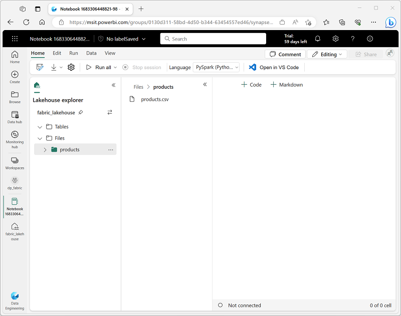

---
lab:
    title: 'Apache Spark でデルタテーブルを使用する'
    module: 'Microsoft Fabric で Delta Lake テーブルを操作する'
---

# Apache Spark でデルタテーブルを使用する

Microsoft Fabric レイクハウスのテーブルは、Apache Spark 用のオープンソース *Delta Lake* フォーマットに基づいています。Delta Lake は、バッチおよびストリーミングデータ操作の両方に対するリレーショナルセマンティクスのサポートを追加し、Apache Spark を使用してデータレイク内の基盤となるファイルに基づいたテーブル内のデータを処理およびクエリするレイクハウスアーキテクチャの作成を可能にします。

この演習は約 **40** 分で完了する予定です。

> **注**: この演習を完了するには、Microsoft の *学校* または *職場* のアカウントが必要です。お持ちでない場合は、[Microsoft Office 365 E3 以上のトライアルにサインアップ](https://www.microsoft.com/microsoft-365/business/compare-more-office-365-for-business-plans)することができます。

## ワークスペースを作成する

Fabric でデータを操作する前に、Fabric トライアルが有効なワークスペースを作成します。

1. `https://app.fabric.microsoft.com` の [Microsoft Fabric ホームページ](https://app.fabric.microsoft.com) で、**Synapse Data Engineering** を選択します。
2. 左側のメニューバーで、**ワークスペース** (アイコンは &#128455; に似ています) を選択します。
3. お好きな名前で新しいワークスペースを作成し、Fabric 容量を含むライセンスモード (*トライアル*、*プレミアム*、または *Fabric*) を選択します。
4. 新しいワークスペースが開いたら、空であるはずです。

    

## レイクハウスを作成し、データをアップロードする

ワークスペースを持ったので、分析するデータのためのデータレイクハウスを作成する時が来ました。

1. **Synapse Data Engineering** ホームページで、お好きな名前で新しい **レイクハウス** を作成します。

    1分ほどすると、新しい空のレイクハウスができます。分析のためにデータレイクハウスにデータを取り込む必要があります。これには複数の方法がありますが、この演習では、単にテキストファイルをローカルコンピューター (または該当する場合はラボ VM) にダウンロードし、その後レイクハウスにアップロードします。

1. この演習の[データファイル](https://github.com/MicrosoftLearning/dp-data/raw/main/products.csv)を `https://github.com/MicrosoftLearning/dp-data/raw/main/products.csv` からダウンロードし、ローカルコンピューター (または該当する場合はラボ VM) に **products.csv** として保存します。

1. レイクハウスを含むウェブブラウザのタブに戻り、**エクスプローラー** ペインの **ファイル** フォルダの **...** メニューで、**新しいサブフォルダ** を選択し、**products** という名前のフォルダを作成します。

1. **products** フォルダの **...** メニューで、**アップロード** > **ファイルをアップロード** を選択し、ローカルコンピューター (または該当する場合はラボ VM) から **products.csv** ファイルをレイクハウスにアップロードします。
1. ファイルがアップロードされたら、**products** フォルダを選択し、以下に示すように **products.csv** ファイルがアップロードされていることを確認します：

    

## データフレームでデータを探索する

1. **ホーム** ページで、データレイクの **products** フォルダの内容を表示している間に、**ノートブックを開く** メニューで、**新しいノートブック** を選択します。

    数秒後、単一の *セル* を含む新しいノートブックが開きます。ノートブックは、*コード* または *マークダウン* (整形されたテキスト) を含むことができる 1 つ以上のセルで構成されています。

2. ノートブックにある既存のセルを選択し、その右上にある **&#128465;** (*削除*) アイコンを使用して削除します - このコードは必要ありません。
3. 左側の **レイクハウスエクスプローラー** ペインで **ファイル** を展開し、**products** を選択して、以前にアップロードした **products.csv** ファイルを表示する新しいペインを表示します：

    

4. **products.csv** の **...** メニューで、**データをロード** > **Spark** を選択します。次のコードが含まれる新しいコードセルがノートブックに追加されるはずです：

    ```python
   df = spark.read.format("csv").option("header","true").load("Files/products/products.csv")
   # df は "Files/products/products.csv" から CSV データを含む Spark DataFrame です。
   display(df)
    ```

    > **ヒント**: 左側のファイルを含むペインは、**<<** アイコンを使用して非表示にすることができます。そうすることで、ノートブックに集中するのに役立ちます。

5. セルの左側にある **&#9655;** (*セルを実行*) ボタンを使用して実行します。

    > **注**: このノートブックで Spark コードを実行するのが初めての場合、Spark セッションを開始する必要があります。これは、最初の実行には 1 分ほどかかることを意味します。その後の実行はより速くなります。

6. セルコマンドが完了したら、セルの下にある出力を確認し、次のように表示されるはずです：

    | Index | ProductID | ProductName | Category | ListPrice |
    | -- | -- | -- | -- | -- |
    | 1 | 771 | Mountain-100 Silver, 38 | Mountain Bikes | 3399.9900 |
    | 2 | 772 | Mountain-100 Silver, 42 | Mountain Bikes | 3399.9900 |
    | 3 | 773 | Mountain-100 Silver, 44 | Mountain Bikes | 3399.9900 |
    | ... | ... | ... | ... | ... |

## デルタテーブルの作成

`saveAsTable` メソッドを使用して、データフレームをデルタテーブルとして保存できます。Delta Lake は、*管理* されたテーブルと *外部* テーブルの両方の作成をサポートしています。

### *管理* テーブルの作成

*管理* テーブルは、スキーマメタデータとデータファイルの両方が Fabric によって管理されるテーブルです。テーブルのデータファイルは **Tables** フォルダに作成されます。

1. 最初のコードセルによって返された結果の下で、新しいコードセルを追加するには、**+ Code** アイコンを使用します（既に存在しない場合）。

    > **ヒント**: **+ Code** アイコンを表示するには、現在のセルからの出力のすぐ下と左にマウスを移動します。または、メニューバーの **Edit** タブで、**+ Add code cell** を選択します。

2. 新しいセルに次のコードを入力して実行します：

    ```python
   df.write.format("delta").saveAsTable("managed_products")
    ```

3. **Lakehouse explorer** ペインで、**Tables** フォルダの **...** メニューから **Refresh** を選択します。次に、**Tables** ノードを展開して、**managed_products** テーブルが作成されたことを確認します。

### *外部* テーブルの作成

スキーマメタデータはレイクハウスのメタストアで定義されていますが、データファイルは外部の場所に保存されている *外部* テーブルも作成できます。

1. 別の新しいコードセルを追加し、次のコードを追加します：

    ```python
   df.write.format("delta").saveAsTable("external_products", path="abfs_path/external_products")
    ```

2. **Lakehouse explorer** ペインで、**Files** フォルダの **...** メニューから **Copy ABFS path** を選択します。

    ABFS パスは、レイクハウスの OneLake ストレージ内の **Files** フォルダへの完全修飾パスです。以下のようなものです：

    *abfss://workspace@tenant-onelake.dfs.fabric.microsoft.com/lakehousename.Lakehouse/Files*

3. コードセルに入力したコードで、**abfs_path** をクリップボードにコピーしたパスに置き換えて、データファイルが **Files** フォルダの **external_products** という名前のフォルダに保存される外部テーブルとしてデータフレームを保存します。完全なパスは次のようになります：

    *abfss://workspace@tenant-onelake.dfs.fabric.microsoft.com/lakehousename.Lakehouse/Files/external_products*

4. **Lakehouse explorer** ペインで、**Tables** フォルダの **...** メニューから **Refresh** を選択します。次に、**Tables** ノードを展開して、**external_products** テーブルが作成されたことを確認します。

5. **Lakehouse explorer** ペインで、**Files** フォルダの **...** メニューから **Refresh** を選択します。次に、**Files** ノードを展開して、テーブルのデータファイル用に作成された **external_products** フォルダがあることを確認します。

### *管理* テーブルと *外部* テーブルの比較

管理テーブルと外部テーブルの違いを探りましょう。

1. 別のコードセルを追加し、次のコードを実行します：

    ```sql
   %%sql

   DESCRIBE FORMATTED managed_products;
    ```

    結果で、レイクハウスの OneLake ストレージへのパスで終わるテーブルの **Location** プロパティを表示します。これは **/Tables/managed_products** になります（完全なパスを表示するには、**Data type** 列を広げる必要があるかもしれません）。

2. `DESCRIBE` コマンドを変更して、次に示すように **external_products** テーブルの詳細を表示します：

    ```sql
   %%sql

   DESCRIBE FORMATTED external_products;
    ```

    結果で、レイクハウスの OneLake ストレージへのパスで終わるテーブルの **Location** プロパティを表示します。これは **/Files/external_products** になります（完全なパスを表示するには、**Data type** 列を広げる必要があるかもしれません）。

    管理テーブルのファイルは、レイクハウスの OneLake ストレージ内の **Tables** フォルダに保存されます。この場合、作成したテーブルの Parquet ファイルと **delta_log** フォルダを保存するために **managed_products** という名前のフォルダが作成されています。

3. 別のコードセルを追加し、次のコードを実行します：

    ```sql
   %%sql

   DROP TABLE managed_products;
   DROP TABLE external_products;
    ```

4. **Lakehouse explorer** ペインで、**Tables** フォルダの **...** メニューから **Refresh** を選択します。次に、**Tables** ノードを展開して、テーブルがリストされていないことを確認します。

5. **Lakehouse explorer** ペインで、**Files** フォルダを展開し、**external_products** が削除されていないことを確認します。このフォルダを選択して、以前 **external_products** テーブルにあったデータの Parquet データファイルと **_delta_log** フォルダを表示します。外部テーブルのテーブルメタデータは削除されましたが、ファイルには影響しませんでした。

### SQL を使用してテーブルを作成する

1. 別のコードセルを追加し、次のコードを実行します：

    ```sql
   %%sql

   CREATE TABLE products
   USING DELTA
   LOCATION 'Files/external_products';
    ```

2. **Lakehouse explorer** ペインで、**Tables** フォルダの **...** メニューから **Refresh** を選択します。次に、**Tables** ノードを展開して、**products** という名前の新しいテーブルがリストされていることを確認します。次に、テーブルを展開して、**external_products** フォルダに保存された元のデータフレームのスキーマと一致していることを確認します。

3. 別のコードセルを追加し、次のコードを実行します：

    ```sql
   %%sql

   SELECT * FROM products;
   ```

## テーブルバージョニングの探索

デルタテーブルのトランザクション履歴は、**delta_log** フォルダ内の JSON ファイルに保存されます。このトランザクションログを使用して、データのバージョニングを管理できます。

1. ノートブックに新しいコードセルを追加し、次のコードを実行します：

    ```sql
   %%sql

   UPDATE products
   SET ListPrice = ListPrice * 0.9
   WHERE Category = 'Mountain Bikes';
    ```

    このコードは、マウンテンバイクの価格を10%引き下げるものです。

2. 別のコードセルを追加し、次のコードを実行します：

    ```sql
   %%sql

   DESCRIBE HISTORY products;
    ```

    結果は、テーブルのトランザクション履歴を表示します。

3. 別のコードセルを追加し、次のコードを実行します：

    ```python
   delta_table_path = 'Files/external_products'

   # 現在のデータを取得
   current_data = spark.read.format("delta").load(delta_table_path)
   display(current_data)

   # バージョン0のデータを取得
   original_data = spark.read.format("delta").option("versionAsOf", 0).load(delta_table_path)
   display(original_data)
    ```

    結果は、価格引き下げ後のデータを含むデータフレームと、元のバージョンのデータを表示するデータフレームの2つを示します。

## ストリーミングデータにデルタテーブルを使用する

デルタレイクはストリーミングデータをサポートしています。デルタテーブルは、Spark Structured Streaming API を使用して作成されたデータストリームの *シンク* または *ソース* になることができます。この例では、シミュレートされた IoT（モノのインターネット）シナリオでストリーミングデータのシンクとしてデルタテーブルを使用します。

1. ノートブックに新しいコードセルを追加します。次に、新しいセルに次のコードを追加して実行します：

    ```python
   from notebookutils import mssparkutils
   from pyspark.sql.types import *
   from pyspark.sql.functions import *

   # フォルダを作成
   inputPath = 'Files/data/'
   mssparkutils.fs.mkdirs(inputPath)

   # JSON スキーマを使用してフォルダからデータを読み取るストリームを作成
   jsonSchema = StructType([
   StructField("device", StringType(), False),
   StructField("status", StringType(), False)
   ])
   iotstream = spark.readStream.schema(jsonSchema).option("maxFilesPerTrigger", 1).json(inputPath)

   # フォルダにイベントデータを書き込む
   device_data = '''{"device":"Dev1","status":"ok"}
   {"device":"Dev1","status":"ok"}
   {"device":"Dev1","status":"ok"}
   {"device":"Dev2","status":"error"}
   {"device":"Dev1","status":"ok"}
   {"device":"Dev1","status":"error"}
   {"device":"Dev2","status":"ok"}
   {"device":"Dev2","status":"error"}
   {"device":"Dev1","status":"ok"}'''
   mssparkutils.fs.put(inputPath + "data.txt", device_data, True)
   print("Source stream created...")
    ```

    *Source stream created...* というメッセージが表示されることを確認します。ただし実行したコードは、仮想の IoT デバイスからの読み取りを表すデータが保存されたフォルダに基づいてストリーミングデータソースを作成しました。

2. 新しいコードセルに次のコードを追加して実行します：

    ```python
   # ストリームをデルタテーブルに書き込む
   delta_stream_table_path = 'Tables/iotdevicedata'
   checkpointpath = 'Files/delta/checkpoint'
   deltastream = iotstream.writeStream.format("delta").option("checkpointLocation", checkpointpath).start(delta_stream_table_path)
   print("Streaming to delta sink...")
    ```

    このコードは、デルタ形式のストリーミングデバイスデータを **iotdevicedata** という名前のフォルダに書き込みます。フォルダの場所のパスが **Tables** フォルダ内にあるため、自動的にテーブルが作成されます。

3. 新しいコードセルに次のコードを追加して実行します：

    ```sql
   %%sql

   SELECT * FROM IotDeviceData;
    ```

    このコードは、ストリーミングソースからのデバイスデータを含む **IotDeviceData** テーブルを照会します。

4. 新しいコードセルに次のコードを追加して実行します：

    ```python
   # ソースストリームにさらにデータを追加
   more_data = '''{"device":"Dev1","status":"ok"}
   {"device":"Dev1","status":"ok"}
   {"device":"Dev1","status":"ok"}
   {"device":"Dev1","status":"ok"}
   {"device":"Dev1","status":"error"}
   {"device":"Dev2","status":"error"}
   {"device":"Dev1","status":"ok"}'''

   mssparkutils.fs.put(inputPath + "more-data.txt", more_data, True)
    ```

    このコードは、ストリーミングソースにさらに仮想デバイスデータを書き込みます。

5. 次のコードを含むセルを再実行します：

    ```sql
   %%sql

   SELECT * FROM IotDeviceData;
    ```

    このコードは、ストリーミングソースに追加されたデータを含むようになった **IotDeviceData** テーブルを再度照会します。

6. 新しいコードセルに次のコードを追加して実行します：

    ```python
   deltastream.stop()
    ```

    このコードはストリームを停止します。

## リソースのクリーンアップ

この演習では、Microsoft Fabric でデルタテーブルを操作する方法を学びました。

レイクハウスの探索を終えたら、この演習のために作成したワークスペースを削除できます。

1. 左側のバーで、ワークスペースのアイコンを選択して、その中に含まれるすべてのアイテムを表示します。
2. ツールバーの **...** メニューで、**ワークスペースの設定** を選択します。
3. **その他** セクションで、**このワークスペースを削除** を選択します。
